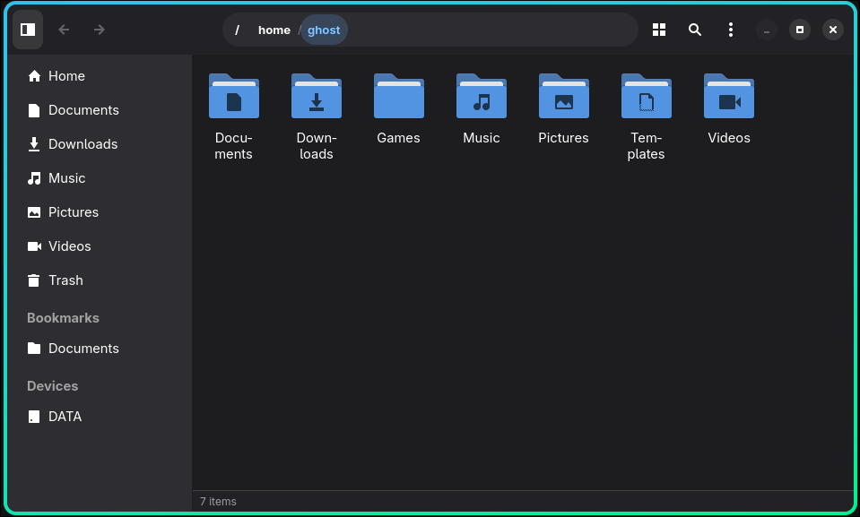

# Wren

A GTK4/libadwaita file manager written in Rust, inspired by GNOME Nautilus.

## Features

- **Icon grid and list views** — switchable per tab, with virtual scrolling for large directories
- **Thumbnails** — displays pre-generated thumbnails from the system cache with GPU-resident texture caching
- **Zoom** — Ctrl+scroll or Ctrl+±/0 to resize icons (32 → 48 → 64 → 96 → 128 px)
- **Tabs** — each tab has independent navigation history, sort state, and view mode
- **Breadcrumb bar** — click any ancestor to jump to it; Ctrl+L to type a path directly
- **Sidebar** — Places (Home, Documents, Downloads, Music, Pictures, Videos, Trash) plus user bookmarks from `~/.config/gtk-3.0/bookmarks`
- **Sort** — by name, size, date modified, or type; reversible; per-tab state
- **Search** — Ctrl+F filters by filename; toggle hidden files with Ctrl+H
- **File operations** — copy, cut, paste, rename, move to trash, permanent delete, new folder, create symlink
- **Batch rename** — find-and-replace across multiple selected files
- **Undo/redo** — for rename and new folder (Ctrl+Z / Ctrl+Shift+Z)
- **Drag and drop** — exports `text/uri-list` for dropping into other apps
- **Open in terminal** — auto-detects kitty, GNOME Terminal, Konsole, Alacritty, and others; configurable in Settings
- **Open With** — choose an application for any file type
- **Properties** — file type, size, and location
- **Live directory monitoring** — folder contents update automatically on external changes
- **Keyboard-driven** — Nautilus-compatible shortcuts throughout

## Screenshots



## Requirements

- GTK 4.12+
- libadwaita 1.6+
- Rust 2024 edition (stable)

### Fedora / Nobara

```bash
sudo dnf install gtk4-devel libadwaita-devel
```

### Ubuntu / Debian

```bash
sudo apt install libgtk-4-dev libadwaita-1-dev
```

### Arch

```bash
sudo pacman -S gtk4 libadwaita
```

## Building

```bash
git clone https://github.com/Gren-95/wren
cd wren
cargo build --release
```

## Running

```bash
cargo run --release
```

Or after `cargo install --path .`:

```bash
wren
```

## Keyboard Shortcuts

| Action | Shortcut |
|--------|----------|
| Navigate back / forward | Alt+Left / Alt+Right |
| Navigate up | Alt+Up |
| New tab | Ctrl+T |
| Close tab | Ctrl+W |
| Focus path bar | Ctrl+L |
| Toggle search | Ctrl+F |
| Toggle hidden files | Ctrl+H |
| Select all | Ctrl+A |
| Open in terminal | Ctrl+Shift+T |
| New folder | Ctrl+Shift+N |
| Rename | F2 |
| Batch rename | Ctrl+Shift+R |
| Copy / Cut / Paste | Ctrl+C / X / V |
| Move to trash | Delete |
| Delete permanently | Shift+Delete |
| Undo / Redo | Ctrl+Z / Ctrl+Shift+Z |
| Zoom in / out / reset | Ctrl+= / Ctrl+- / Ctrl+0 |
| Properties | Alt+Enter |
| Add bookmark | Ctrl+D |
| Create link | *(context menu)* |
| Open with | Ctrl+Shift+O |

## License

GNU General Public License v3.0 or later (GPL-3.0-or-later). See [LICENSE](LICENSE).
